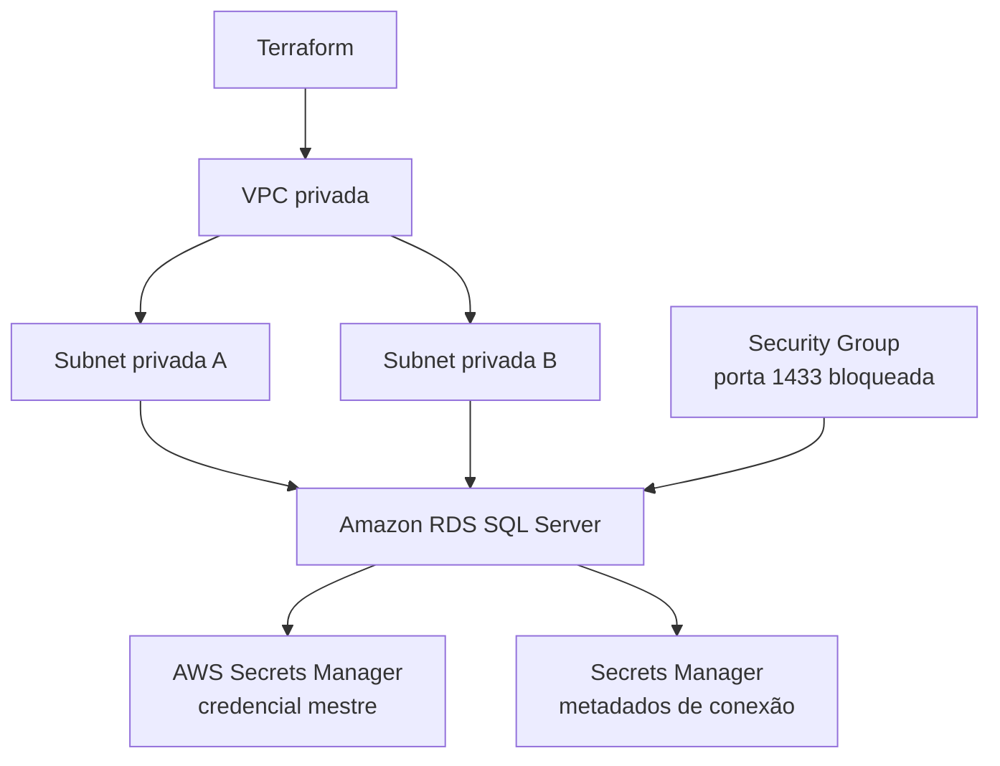

# GearFlow - Infraestrutura do Banco de Dados

Este repositório provisiona, com Terraform, a infraestrutura de banco de dados
gerenciado do GearFlow. O escopo é apenas a infraestrutura: VPC privada,
subnets, firewall, Amazon RDS for SQL Server e AWS Secrets Manager.

Não pertencem a este repositório a API, Kubernetes, Lambda, migrations ou
qualquer conexão entre esses componentes.

## Arquitetura



## Tecnologias

- Terraform 1.15.8
- HashiCorp AWS Provider 6.x
- Terraform Cloud, organização `gearflowfiapmurilo`
- Amazon VPC, Amazon RDS for SQL Server, AWS Secrets Manager e CloudWatch Logs

## Estrutura

```text
terraform/
├── network.tf       # VPC, subnets e DB Subnet Group
├── security.tf      # Security Group e futuras autorizações
├── database.tf      # Instância RDS SQL Server
├── secrets.tf       # Referências de segredo
├── outputs.tf       # Contratos para integrações futuras
└── environments/    # Exemplos de homologação e produção
```

## Preparação local

```powershell
cd terraform
terraform fmt -check -recursive
terraform init -backend=false
terraform validate
```

`init -backend=false` é útil antes de configurar a autenticação do Terraform
Cloud. Para usar o state remoto, execute `terraform init` sem essa opção depois
de autenticar no Terraform Cloud.

## Ambientes

Os exemplos em `terraform/environments/` não contêm segredos. Copie o arquivo
adequado para um `.tfvars` local e ajuste os valores antes de usar:

```powershell
Copy-Item environments\homolog.tfvars.example homolog.tfvars
```

Arquivos `.tfvars` são ignorados pelo Git. Homologação usa uma instância menor,
sem Multi-AZ e removível; produção habilita Multi-AZ, proteção contra exclusão
e snapshot final.

## Segredos e banco lógico

A senha mestre não é mantida no código Terraform. No primeiro deploy, o RDS
cria e administra essa credencial no AWS Secrets Manager. Outro segredo guarda
somente metadados de conexão e o ARN da credencial mestre.

`GearFlowDb` é um contrato para a aplicação futura. No RDS SQL Server, ele não
é criado pela instância; as migrations da aplicação o criarão durante a futura
integração.

## Próximos passos

1. Autenticar o Terraform Cloud e ativar o state remoto.
2. Configurar a conta AWS e validar serviços, permissões e orçamento.
3. Executar `terraform plan` para homologação.
4. Criar CI/CD em etapa posterior.
