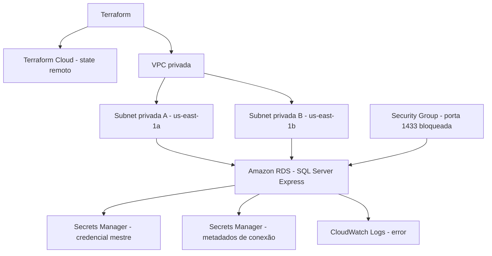

# GearFlow - Infraestrutura do Banco de Dados

Este repositório contém a infraestrutura como código do banco de dados gerenciado do GearFlow. Ele corresponde ao Repositório 3 da Fase 3 e usa Terraform para provisionar uma rede privada, Amazon RDS for SQL Server e AWS Secrets Manager.

API, Kubernetes, Lambda, migrations e CI/CD não fazem parte deste repositório neste momento.

## Status atual

O ambiente de homologação foi validado e provisionado no AWS Academy Lab, na região `us-east-1`.

| Item | Configuração |
|---|---|
| Banco | Amazon RDS for SQL Server Express 2022 |
| Versão | `16.00.4255.1.v1` |
| Classe | `db.t3.micro` |
| Armazenamento | 20 GiB `gp3`, até 100 GiB |
| Acesso público | Desativado |
| Porta | TCP 1433 bloqueada por padrão |
| State remoto | Terraform Cloud: `gearflow-infra-database` |

## Arquitetura



## Segurança

- O RDS não recebe endereço público.
- O Security Group não libera a porta 1433 por padrão.
- A senha mestre é gerada e administrada pelo RDS no AWS Secrets Manager.
- Credenciais AWS, senhas e arquivos `.tfvars` locais não são versionados no Git.
- O acesso futuro será liberado apenas por CIDR ou Security Group autorizado.

Por ser privado, o banco não aceita conexão direta do computador local. A conexão SQL será feita futuramente por uma aplicação autorizada no Kubernetes ou por um cliente temporário dentro da VPC.

## Tecnologias

- Terraform 1.15.8
- HashiCorp AWS Provider 6.x
- Terraform Cloud, organização `gearflowfiapmurilo`
- Amazon VPC, Amazon RDS, AWS Secrets Manager e CloudWatch Logs
- AWS Academy Lab

## Estrutura

```text
terraform/
├── versions.tf       # Terraform Cloud e versões
├── providers.tf      # Provider AWS e tags
├── network.tf        # VPC, subnets e DB Subnet Group
├── security.tf       # Firewall do banco
├── database.tf       # Instância RDS
├── secrets.tf        # Segredos e metadados de conexão
├── outputs.tf        # Contratos para integrações futuras
└── environments/     # Exemplos de homologação e produção
docs/
├── architecture.md
├── rfc-001-cloud-and-database.md
└── adr-001-managed-sql-server.md
```

## Preparação local

Pré-requisitos: Terraform `1.15.8`, acesso ao Terraform Cloud e sessão ativa do AWS Academy Lab para comandos que consultem a AWS.

```powershell
cd terraform
terraform login
terraform init
terraform validate
Copy-Item environments\homolog.tfvars.example homolog.tfvars
```

O arquivo `homolog.tfvars` é ignorado pelo Git. Ele deve manter os valores validados no Lab:

```hcl
aws_region               = "us-east-1"
availability_zones       = ["us-east-1a", "us-east-1b"]
sqlserver_engine_version = "16.00.4255.1.v1"
```

## Uso com AWS Academy

Em cada sessão do Lab, copie as credenciais temporárias em **AWS Details** para a janela atual do PowerShell:

```powershell
$env:AWS_ACCESS_KEY_ID = "..."
$env:AWS_SECRET_ACCESS_KEY = "..."
$env:AWS_SESSION_TOKEN = "..."
$env:AWS_DEFAULT_REGION = "us-east-1"

aws sts get-caller-identity
```

Não salve ou envie esses valores. Eles expiram ao final da sessão do Lab.

## Comandos Terraform

```powershell
# Formatação e sintaxe
terraform fmt -check -recursive
terraform validate

# Visualizar alterações sem criar recursos
terraform plan -var-file="homolog.tfvars"

# Criar ou atualizar a infraestrutura
terraform apply -var-file="homolog.tfvars"

# Confirmar sincronização após o deploy
terraform plan -var-file="homolog.tfvars"

# Consultar outputs
terraform output

# Remover o ambiente de homologação
terraform destroy -var-file="homolog.tfvars"
```

## Validação do deploy

No AWS Management Console, selecione **US East (N. Virginia)** e abra **RDS → Databases**. A instância `gearflow-sqlserver-homolog` deve apresentar:

```text
Status: Available
```

Também valide:

- engine SQL Server Express 2022 e classe `db.t3.micro`;
- acesso público desativado;
- VPC e duas subnets privadas;
- Security Group sem regras de entrada;
- dois segredos no AWS Secrets Manager;
- state remoto no Terraform Cloud.

## Custos e limpeza

O RDS consome créditos enquanto existir, mesmo sem conexões. Para testes no AWS Academy, faça o deploy, registre as evidências e execute `terraform destroy` ao terminar.

A homologação usa `skip_final_snapshot = true` e `secret_recovery_window_in_days = 0` para facilitar a limpeza.

## Integrações futuras

O RDS cria a instância SQL Server, mas não cria o banco lógico `GearFlowDb`. Esse banco será criado pelas migrations da aplicação no futuro.

Os demais repositórios poderão consumir endpoint, porta, IDs de VPC e Security Group, além dos ARNs dos segredos expostos pelos outputs Terraform.

## Evidências para a Fase 3

- proteção da branch `main` e Pull Requests;
- `terraform plan` e `terraform apply` bem-sucedidos;
- state no Terraform Cloud;
- RDS com status `Available`;
- secrets e regras de segurança;
- documentação em `docs/`.
